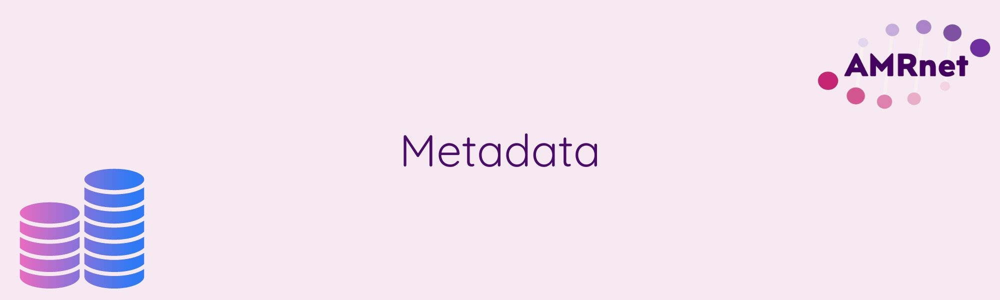

***Description***

---

# Home

Welcome to this page XXXX, developed by [AMRnet](https://www.amrnet.org/). 

## Description

xxxx....

* {doc}`page-1/about`

## Context and motivation

The main motivation for this .....

## Intended audience

The primary audience for this ...

We hope this page will also be useful to a broader audience including anyone who is interested in learning more about genomic data and how it could be used for microbial genomic surveillance.

## Learning objectives

At the end o...., you will be able to:

1. ...
2. ...
3. ...

## Prerequisites

....

we will use [Google Colaboratory](https://colab.research.google.com/) (a.k.a. Colab), which is an interactive cloud computing service provided for free by Google. In order to use Colab you will need to have a Google user account. If you do not already have a Google user account, please make sure to create one before you start the course.
